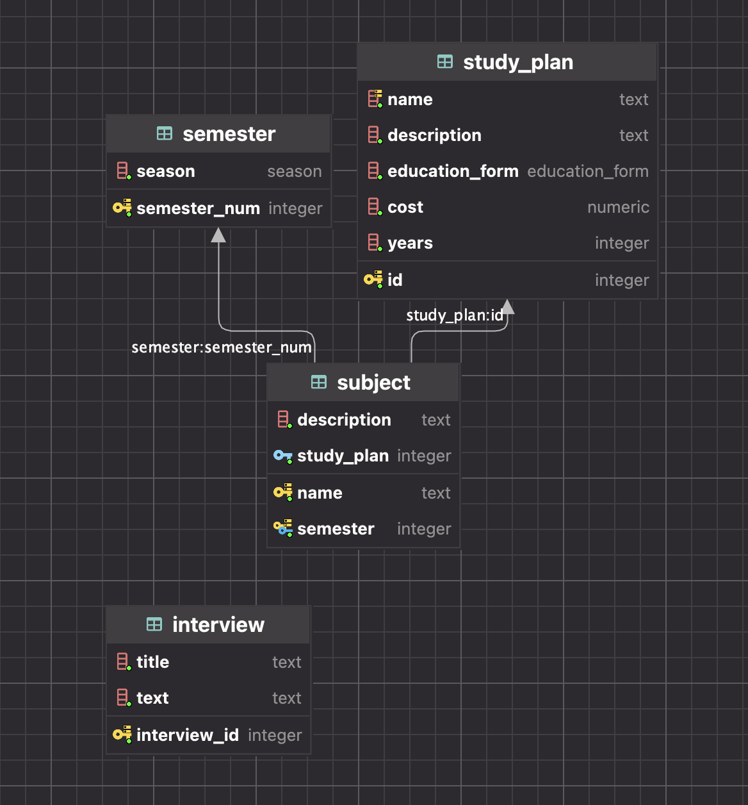

# web
Усатов Никита M33071
Сайт ИТМО ИС

https://is-y25-website.onrender.com/

Описания сущностей:

```sql
season - ENUM ('Fall', 'Spring');

TABLE semester
(
semester_num INTEGER PRIMARY KEY,
season       season NOT NULL
);

TABLE interview
(
interview_id INTEGER GENERATED BY DEFAULT AS IDENTITY PRIMARY KEY,
title        TEXT NOT NULL,
text         TEXT NOT NULL
);

TYPE education_form - ENUM ('Extramural', 'Full-Time');

TABLE study_plan
(
id             INTEGER GENERATED BY DEFAULT AS IDENTITY PRIMARY KEY,
name           TEXT           NOT NULL UNIQUE,
description    TEXT           NOT NULL,
education_form education_form NOT NULL,
cost           NUMERIC        NOT NULL,
years          INTEGER        NOT NULL
);

TABLE subject
(
name        TEXT    NOT NULL,
description TEXT    NOT NULL,
semester    INTEGER NOT NULL REFERENCES semester (semester_num) ON DELETE CASCADE,
study_plan  INTEGER NOT NULL REFERENCES study_plan (id) ON DELETE CASCADE DEFAULT 1,
PRIMARY KEY (name, semester)
);
```
